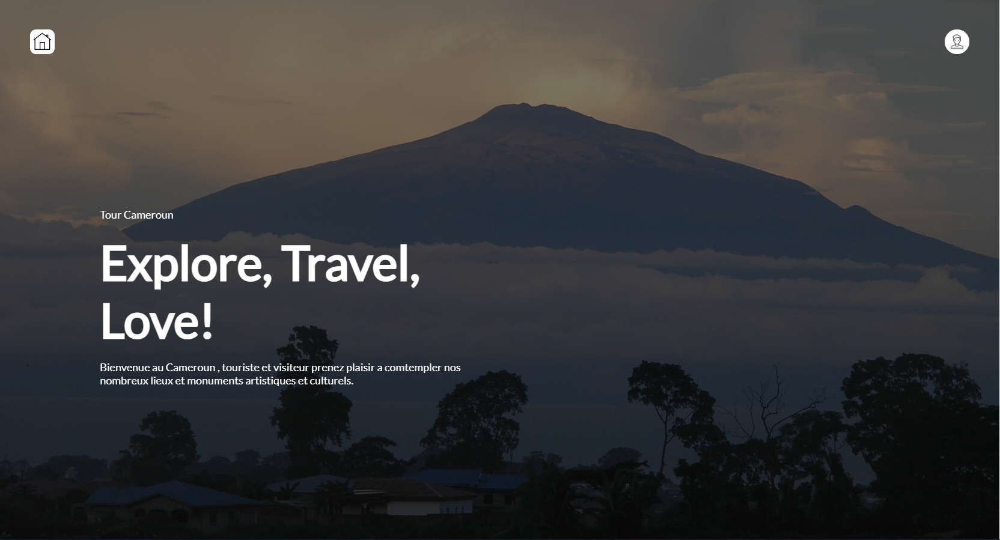
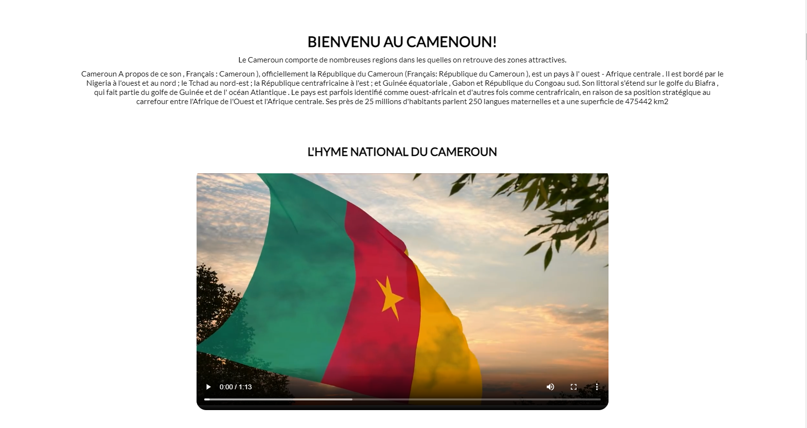
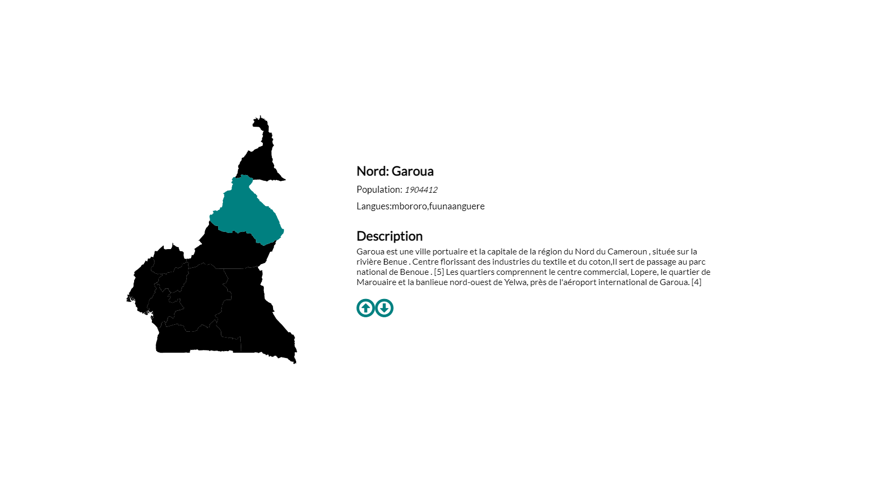

# TourCameroun

## Project Overview
  Cameroun A propos de ce son , Français : Cameroun ), officiellement la République du Cameroun (Français: République du Cameroun ), est un pays à l' ouest - Afrique centrale. Il est bordé par le Nigeria à l'ouest et au nord ; le Tchad au nord-est ; la République centrafricaine à l'est ; et Guinée équatoriale , Gabon et République du Congoau sud. Son littoral s'étend sur le golfe du Biafra , qui fait partie du golfe de Guinée et de l' océan Atlantique . Le pays est parfois identifié comme ouest-africain et d'autres fois comme centrafricain, en raison de sa position stratégique au carrefour entre l'Afrique de l'Ouest et l'Afrique centrale. Ses près de 25 millions d'habitants parlent 250 langues maternelles et a une superficie de 475442 km2

# User Interface

# Hosted Link:

:point_down: :point_down: :point_down:

[Click Here!](https://coderprodigestive.netlify.app/)

Made with :heart: by @LesCodersPro during the sevenKids code program August 2021